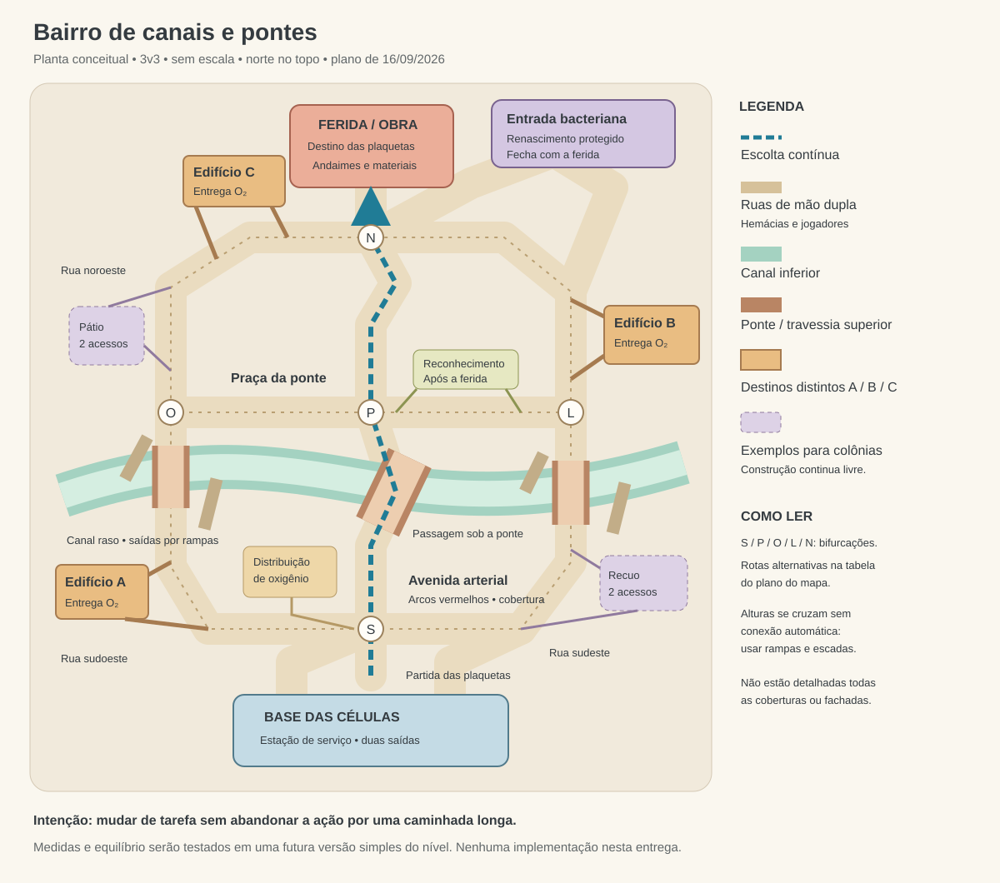

# Plano do mapa — bairro de canais e pontes

## Status e escopo

Plano consolidado em 16/09/2026 após a entrevista de design e a aprovação das
recomendações pelo usuário. Entrega desta sessão: plano e planta esquemática,
sem modificar o código do jogo.

Complementa o [plano de objetivos e heróis](PLANO_OBJETIVOS_E_HEROIS.md).
Condições de vitória, economia individual, limites de colônias, desbloqueios e
kits continuam definidos naquele documento. As entregas e a fuga das hemácias
descritas aqui detalham sua circulação futura.

A inspeção do código identificou uma arena atual de 96 × 120 unidades, três
avenidas, edifícios repetidos e telhados acessíveis, para 3v3. Essas medidas
descrevem o jogo existente, não dimensões aprovadas para o redesenho. As novas
regras do plano principal ainda dependem de implementação.

## 1. Experiência aprovada

- Manter **3v3**, incluindo partidas com bots.
- Priorizar decisões táticas, com caminhos curtos entre atividades.
- Alternar entre liberar a escolta, proteger/caçar hemácias e atacar/desenvolver
  colônias, percebendo o custo de deixar os aliados temporariamente desfalcados.
- Criar um bairro compacto com conexões transversais; evitar três frentes
  independentes e distantes que dispersem os seis jogadores.
- Usar canais e pontes como identidade principal, uma avenida arterial como
  marco visual e uma área de manutenção das plaquetas junto à ferida.

Hipótese a validar: aproximar objetivos permite mudar de tarefa sem esvaziar o
combate. O novo desenho ainda não foi testado em uma partida.

## 2. Planta esquemática

[Abrir a planta em SVG](PLANTA_MAPA.svg).

A planta mostra conexões e relações espaciais, **sem escala**. Norte é apenas
uma orientação de leitura. Curvas, larguras, alturas e distâncias serão
ajustadas numa futura versão simples do nível.

| Elemento | Função |
| --- | --- |
| Base das células, ao sul | Estação de serviço com duas saídas protegidas; construção bacteriana proibida no interior. |
| Avenida arterial | Início do percurso; arcos vermelhos e fachadas altas ao fundo. |
| Praça da ponte | Conecta ruas e alturas; marco de orientação e local do reconhecimento. |
| Obra da ferida, ao norte | Destino das plaquetas; ruptura, andaimes e materiais de reparo. |
| Entrada bacteriana | Junto à ruptura, com acessos laterais e anteparos contra tiros diretos ao renascimento. |
| Edifícios A, B e C | Destinos distintos de oxigênio; letras apenas identificam a planta. |
| Ruas laterais | Desvios curtos para fuga, interceptação e transporte de recursos. |
| Canal | Rota inferior rasa com passagem sob a ponte e saídas frequentes. |
| Pátios e recuos | Exemplos de espaços favoráveis a colônias; não são terrenos obrigatórios. |

Avenida → praça → obra são trechos de uma **escolta contínua**, sem novas fases,
capturas obrigatórias ou checkpoints.

### Rede de circulação das hemácias

A distribuição de oxigênio liga-se à bifurcação sul (S). Dois circuitos de ruas
conectam S à praça (P), oeste (O), leste (L) e norte (N). Exemplos de trajetos:

| Destino | Caminho possível | Alternativa |
| --- | --- | --- |
| Edifício A | S → rua sudoeste → A | S → P → O → A |
| Edifício B | S → rua sudeste → L → B | S → P → L → B |
| Edifício C | S → P → O → rua noroeste → C | S → P → L → N → C |

São exemplos de conectividade, não trilhos obrigatórios ou sempre seguros.
Cada edifício terá aproximações por lados diferentes, evitando que as duas
alternativas terminem num corredor longo sem saída. Destinos ficam fora das
bases e não exigem passar pela ferida. A distribuição desenhada é uma referência
logística para o protótipo, não um novo objetivo capturável.

## 3. Escolta, bases e linhas de tiro

Plaquetas partem das proximidades da estação das células até a ferida. Mantêm-se
movimento automático, bloqueio apenas por bactéria viva à frente na mesma
passagem e progresso preservado. Inimigos acima, abaixo da ponte ou atrás de
paredes não bloqueiam por proximidade.

Cada ponto favorável à defesa oferece aproximação com cobertura e desvio curto
para ataque lateral. Curvas, fachadas, pilares e materiais de obra interrompem
linhas de tiro. Evitar uma varanda que domine simultaneamente todos os acessos
ao objetivo ou visão contínua entre as bases.

A base das células tem duas saídas protegidas. A entrada bacteriana fica junto
à ruptura, mas seu ponto de aparecimento é resguardado dos tiros da escolta.
Conexões laterais permitem entrar no bairro sem atravessar diretamente a frente
inimiga. A proteção proposta é geométrica; não adiciona invulnerabilidade.

Fechar a ferida corta o renascimento pela entrada. O bairro permanece conectado
para bactérias sobreviventes e colônias. A obra não deve ser a única passagem
entre duas metades do mapa.

## 4. Alturas, interiores e canal

Dois níveis principais: rua e passarelas baixas. O canal acrescenta um desnível
local, sem formar um terceiro andar extenso.

- Pontes, varandas selecionadas e alguns interiores curtos criam alternativas.
- Escadas ou rampas levam todos os heróis às posições importantes.
- Habilidades de mobilidade encurtam caminhos, sem acesso exclusivo a objetivos.
- Posições elevadas têm aproximação protegida para jogadores no nível inferior.
- Prédios altos ao fundo dão escala sem exigir muitos andares exploráveis.
- Interiores atravessáveis têm entradas e saídas claras, sem labirintos de salas.
- Canal raso permite passar sob pontes e romper contato visual.
- Saídas frequentes por rampas/escadas, inclusive antes e depois da ponte.
- Sem morte instantânea por cair no canal ou correnteza nesta primeira versão.

Entrar no canal reduz a exposição à rua, mas deixa o jogador abaixo dos
adversários. Pilares, guarda-corpos e saídas devem preservar essa troca sem
criar abrigo invulnerável ou armadilha sem fuga.

## 5. Hemácias: destinos, percepção e fuga

### Entregas distribuídas

Hemácias levam oxigênio a **edifícios diferentes**. Não seguem todas para a
ferida ou para um único destino. Cada edifício tem pelo menos dois caminhos
possíveis. Rotas visíveis passam perto da escolta e entram nas ruas laterais,
criando oportunidades de proteção, caça e interceptação.

Entregar caracteriza a circulação do bairro. Este plano não adiciona pontuação
por entrega ou muda condições de vitória. Cadência, distribuição entre destinos
e ciclo após entregar ficam para a implementação futura; não são necessários
para fixar as conexões da planta.

### Comportamento aprovado

1. **Entrega:** segue um caminho até seu edifício.
2. **Percepção:** ao avistar bactéria com linha de visão, interrompe a aproximação.
   Não detecta automaticamente inimigos através de paredes.
3. **Fuga:** afasta-se da ameaça, buscando cobertura e bifurcação segura.
4. **Desvio:** tenta outra rota para o mesmo destino; pode recuar antes de prosseguir.
5. **Sem saída segura:** busca afastamento e abrigo alcançáveis, permanecendo
   vulnerável; não avança deliberadamente contra o bloqueio conhecido.
6. **Retomada:** após um período sem avistar perigo, retoma a entrega.

Para evitar oscilação, mantém uma escolha por um intervalo mínimo. Ameaça nova
e imediata deve permitir reação antes desse intervalo terminar; manter uma
rota não pode obrigá-la a caminhar até a morte.

Bifurcações antes dos trechos expostos e coberturas permitem romper contato
visual. Fugir não significa ser mais rápida que todos os perseguidores: as
bactérias podem antecipar caminhos e usar habilidades. Hemácias não possuem
conhecimento perfeito de todos os inimigos do mapa.

Alcance/ângulo de visão, velocidade, memória da ameaça, reavaliação e retomada
são ajustáveis. Testar se a fuga paralisa a economia ou facilita demais a caça.
Recursos continuam surgindo da morte e sendo recolhidos fisicamente, conforme
o plano principal.

## 6. Colônias e reconhecimento

### Construção livre com disputa possível

Preservar construção em chão acessível, com espaço e fora da base das células,
até três colônias por jogador bacteriano. Pátios, recuos de depósitos e espaços
sob pontes são exemplos, não locais exclusivos.

Lugares favoráveis escondem a colônia da visão distante, mas permitem sinais
visuais e sonoros na aproximação. Devem ter pelo menos duas aproximações para
ataque. Evitar frestas e posições que exijam um herói específico.

Perto da circulação, obter recursos e reforços é rápido, com maior exposição.
Mais afastado, há discrição, mas transportar recursos custa tempo. O limite
permite até nove colônias em 3v3: o bairro precisa suportar essa distribuição
sem uma procura demorada por espaços residuais.

### Reconhecimento após fechar a ferida

Um posto na praça central fica visível desde o início e utilizável depois do
fechamento. A ação disputável revela temporariamente as colônias restantes.
O posto tem dois acessos e fica fora da linha de tiro direta das bases.

Ele devolve a disputa ao bairro e reduz buscas sem informação no final. Não
recebe antígenos, não desbloqueia heróis e não revela colônias permanentemente.
Tempos de ativação e revelação continuam ajustáveis.

## 7. Direção visual

Referências locais em `referencias/`:

| Arquivo | Aplicação |
| --- | --- |
| `Captura de tela 2026-09-06 201949.png`, `Key_visual_1.webp` | Pontes de tijolo, ruas em desnível, água clara, guarda-corpos escuros, fachadas creme e pedras no piso. |
| `Captura de tela 2026-09-06 202231.png` | Avenida ocre, arcos vermelhos, placas suspensas e escala monumental ao fundo. |
| `Captura de tela 2026-09-06 202435.png` | Praça legível, marcações de circulação e estruturas vermelhas/azuis. |
| `Captura de tela 2026-09-06 202844.png`, `Captura de tela 2026-09-06 202914.png` | Túneis de tijolos, caixas, materiais e barreiras na manutenção. |
| `Captura de tela 2026-09-16 090415.png`, `Captura de tela 2026-09-16 090508.png` | Escadas, arcos e transporte de materiais pelas plaquetas; escala humana para a obra. |

Usar creme, ocre e terracota, água clara, sombras suaves e contornos legíveis.
Arcos, esquadrias, placas e caixas dão identidade; pilares, muros e depósitos
servem também como cobertura. Decoração não deve esconder silhuetas, recursos,
saídas ou sinais de colônias. Adaptar distâncias e curvas ao combate, mantendo
a sensação de cidade habitada das referências.

## 8. Implementação futura e critérios de validação

Começar por volumes simples e caminhos, antes do acabamento. Validar no contexto
das novas regras: o modo antigo sozinho não demonstra que o redesenho funciona.

| Área | Trabalho futuro |
| --- | --- |
| Geometria e colisão | Ruas, rampas, ponte com passagem inferior, canal, anteparos e interiores. |
| Objetivos | Trajeto das plaquetas, ferida, entrada bacteriana e reconhecimento. |
| Navegação | Alturas separadas, múltiplas rotas por destino e desvios por ameaça. |
| Economia e construção | Destinos de hemácias, recursos alcançáveis e posições válidas de colônias. |
| Bots e rede | Participação no ciclo completo; estados coerentes entre host/clientes. |
| Arte | Fachadas, pontes e marcos próprios de cada trecho, preservando a leitura. |

### Cenários de aceitação

- Todos os heróis alcançam posições e objetivos importantes sem habilidade.
- Escolta percorre o trajeto; bactéria sobre/sob a ponte ou atrás de parede
  não bloqueia indevidamente as plaquetas.
- Cada defesa forte tem aproximação protegida e alternativa lateral viável.
- Bases não têm visão direta entre si; testar pressão sobre as duas saídas
  para evitar prender adversários ao renascimento.
- Em cada destino, ameaçar uma rota provoca desvio. Ameaçar todas não faz a
  hemácia avançar contra o bloqueio conhecido ou oscilar indefinidamente.
- Bactéria oculta por parede não provoca fuga por visão; sair da cobertura
  permite percepção. Remover a ameaça permite retomar a entrega.
- Destinos diferentes recebem circulação; não há convergência geral para a ferida.
- Bactérias conseguem interceptar hemácias e sustentar construção/desenvolvimento
  sem depender de alvos parados ou incapazes de fugir.
- Canal e interiores têm saídas claras; recursos e personagens não ficam presos.
- Colônias em recuos, pátios e sob pontes são alcançáveis, perceptíveis de perto
  e destrutíveis. Testar até nove colônias distribuídas pelo bairro.
- Fechar a ferida desativa o retorno pela entrada, preserva as conexões do bairro
  e habilita o reconhecimento, que pode ser usado e contestado.
- Partidas completas permitem a vitória de ambos os lados pelas novas regras.

Observar tempo para reencontrar combate, tempo de desvio para outra atividade,
busca por colônias, entregas/fugas/mortes de hemácias e períodos sem recursos
bacterianos. Ajustar tamanho, coberturas e conexões pelos resultados.

As escolhas de experiência, topologia e comportamento estão aprovadas. Medidas,
quantidade simultânea de hemácias, velocidades, tempos, distribuição de entregas
e intensidade de detalhes visuais serão calibrados na implementação futura.
Nenhum valor de balanceamento é apresentado como validado. A planta não é um
arquivo de nível executável.
